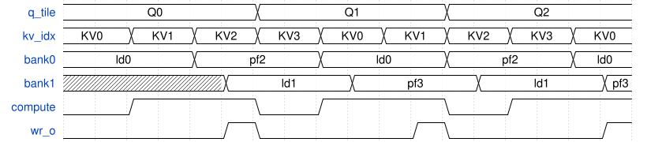
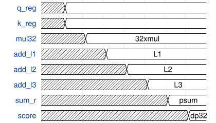
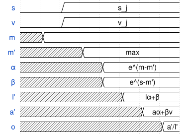
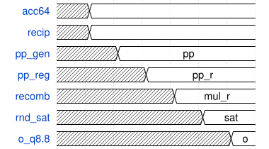

## 3. 具体设计方案

### 3.1 实现算法说明

目标算子为 Scaled Dot-Product Attention。对给定查询矩阵 $Q\in\mathbb{R}^{S\times D}$、键矩阵 $K\in\mathbb{R}^{S\times D}$ 和值矩阵 $V\in\mathbb{R}^{S\times D}$，标准形式可写为

$$
\mathrm{SDPA}(Q,K,V)=\mathrm{softmax}\left(\frac{QK^T}{\sqrt D}\right)V.
$$

若直接先显式形成 $S\times S$ 的 score 矩阵，再统一做 softmax 和乘以 $V$，则在本题规模下会引入明显的片上存储压力。以 $S=256$ 为例，若 score 也采用 16bit 表示，则完整矩阵大小为

$$
256\times 256 \times 16\text{ bits}=1{,}048{,}576\text{ bits}=128\text{ KB},
$$

这已经接近甚至超过当前算子内多个片上 buffer 的总和，并且会破坏 FlashAttention 以流式更新代替显式矩阵存储的核心思想。因此本设计采用 online softmax 递推形式，以行为粒度维护三组状态：当前最大值 $m$、分母累计量 $l$ 以及加权和值累计向量 $\mathrm{acc}$。对于任意新到达的 score $s_j$ 与 value 向量 $v_j$，更新公式为

$$
m' = \max(m, s_j),
$$

$$
l' = l\cdot e^{m-m'} + e^{s_j-m'},
$$

$$
\mathrm{acc}' = \mathrm{acc}\cdot e^{m-m'} + e^{s_j-m'}\cdot v_j.
$$

在一行处理完全部 key 之后，最终输出为

$$
o = \frac{\mathrm{acc}}{l}.
$$

这套递推是 FlashAttention 与 online softmax 文献中的核心思想，其工程优势在于：第一，不再需要存储完整的 score 矩阵；第二，每个 score 一旦算出就可以立刻参与 softmax 更新与 PV 累加；第三，状态只需按 query 行保存，而不依赖于历史全部 score。当前设计又进一步将查询并行度设置为 `ROW_PAR=2`，即每次同时处理两个 query row，从而在不明显增大调度复杂度的前提下提高吞吐效率。

在数值表示上，输入的 $Q$、$K$、$V$ 以及输出 $O$ 都采用 Q8.8 定点格式。两个 Q8.8 数相乘得到 Q16.16 结果，因此点积累加器至少需要 32bit 以上精度。当前主线中，点积路径输出采用 40bit 中间和，行累计 `row_acc` 仍保留为 64bit 存储接口以兼容归一化通路。online softmax 恢复为 `ctx` 方案后，模块内部的 `l/acc` 标量状态使用 Q16.16 和 32bit 累计，再由 core 以符号扩展方式写回 `row_acc[63:0]`，从而在不重写 normalize 接口的前提下先恢复主线功能。倒数模块 `fa_recip_nr_q16_16` 输出 Q16.16，而归一化乘法器再将 64bit 累计量与 Q16.16 倒数相乘并回落到 Q8.8。对于 $D=64$ 的默认参数，缩放因子为

$$
\frac{1}{\sqrt{64}} = \frac{1}{8} = 0.125,
$$

映射到 Q8.8 后恰好为 $0.125\times 256 = 32$，因此 `SCALE` 寄存器的默认值设置为十进制 `32`。

当前架构还引入了 tile 化组织。序列长度 $S=256$ 被分成 `TQ=32` 的 query tile 和 `TK=64` 的 key/value tile，因此

$$
\mathrm{NUM\_Q\_TILES}=\frac{256}{32}=8,
\qquad
\mathrm{NUM\_K\_TILES}=\frac{256}{64}=4.
$$

设计采用外层遍历 Q tile、内层遍历 K/V tile 的双层调度。每次只在片上保存一个 Q tile、一个正在计算的 K/V tile 以及一个预取中的 K/V tile。由于 score 的计算与 online softmax 更新是流式进行的，因此整个 tile 过程始终不需要显式写出任何中间注意力矩阵。

### 3.2 设计总体框图

当前顶层结构可以抽象为如下层次：

```text
				┌──────────────────────────────┐
				│      Host / CPU / SoC        │
				│ AXI-Lite cfg + AXI memory    │
				└──────────────┬───────────────┘
							   │
				 ┌─────────────▼─────────────┐
				 │     fa_attention_ip_top    │
				 │                             │
				 │  ┌──────────────────────┐   │
AXI-Lite slave ──┼─▶│  fa_axi_lite_regs    │   │
				 │  └──────────────────────┘   │
				 │                             │
AXI4 master  ────┼─▶ fa_dma_reader            │
				 │  fa_dma_writer             │
				 │                             │
				 │  ┌──────────────────────┐   │
				 │  │  fa_attention_core   │   │
				 │  │  Q/K/V/O tile FSM    │   │
				 │  │  online softmax      │   │
				 │  │  QK + PV + norm      │   │
				 │  └──────────────────────┘   │
				 │                             │
				 │  ┌──────────────────────┐   │
				 │  │  fa_perf_counters    │   │
				 │  └──────────────────────┘   │
				 └─────────────────────────────┘
```

在顶层看来，`fa_axi_lite_regs` 负责软件可见的配置与状态窗口，`fa_dma_reader/fa_dma_writer` 分别负责从系统内存搬运 Q/K/V 与将 O 写回系统内存，而 `fa_attention_core` 则是完整的调度与数据通路中心。值得强调的是，本设计并未将计算控制器与数据通路彻底分离，而是选择将 tile 调度、DMA 命令发起、online softmax 状态维护、QK/PV 计算与最终归一化都放入一个强内聚的核心中。这种做法牺牲了一部分模块边界上的整洁性，但换来了早期迭代阶段更直接的功能闭环和更清晰的时序归因。

### 3.3 模块间数据流向

一次完整 attention 计算的主数据流可叙述如下。首先，软件通过 AXI-Lite 将 `Q_BASE`、`K_BASE`、`V_BASE`、`O_BASE`、`STRIDE_BYTES`、`SCALE`、`NEG_LARGE` 等寄存器写入顶层寄存器文件，然后向 `CTRL` 寄存器写入启动脉冲。顶层寄存器文件将该启动脉冲转化为 `fa_attention_core` 的 `i_start`，同时保持各个配置参数处于稳定状态。

在 `fa_attention_core` 内部，主状态机首先进入 `S_LOAD_Q`，通过 DMA reader 发出一个 query tile 读命令，并将读回的总线 beat 逐个解包为 `q_buf[TQ][D]`。随后，状态机进入 `S_INIT_CONTEXT`，将当前 query tile 对应的 `row_m`、`row_l`、`row_acc` 进行初始化，其中 `row_m` 初始化为 `NEG_LARGE`，`row_l` 初始化为零，`row_acc` 初始化为零向量。

接下来主状态机依次对 4 个 K/V tile 循环。对于每个 tile，先加载 K，再加载 V；进入 `S_COMPUTE` 后，内部子状态机 `cs` 会以 `ROW_PAR=2` 为粒度遍历 query 行对，以 `DP_CHUNKS=2` 为粒度遍历 32-lane 的点积切片，以 `TK=64` 的长度遍历 key/value 行。每个 score pair 先经过 QK 点积，再乘以缩放因子，随后进入 online softmax 更新模块产生新的 `m`、`l` 和 `acc`。由于 `V` 行与新生成的 softmax 权重在同一拍的组合中被使用，因此 score 一旦计算完毕，便立即以流式方式并入 `row_acc`，不需要中间存储 score 阵列。

当所有 K/V tile 完成后，核心进入 `S_NORMALIZE`。此时每个 query row 的 `row_acc` 和 `row_l` 已经累积完毕，归一化逻辑先对 `row_l` 启动倒数模块，再以 `NORM_LANES=8` 的向量宽度将 `row_acc` 分块乘以倒数，得到最终的 `o_buf[TQ][D]`。最后，`S_WRITE_O` 通过 DMA writer 将 O tile 写回系统内存，并在 `S_NEXT_Q` 中决定是否继续处理下一个 Q tile。当全部 tile 结束后，顶层将 `done` 置位并允许软件读取 `CYCLES` 与性能计数器寄存器。



如果将上述过程按一次完整运行的地址搬运量来观察，则 Q 只在每个 Q tile 开始时读取一次，而 K/V 会对每个 Q tile 重复遍历全部 4 个 tile。之所以这样设计，是因为该架构的优化重点并不是极端减少片外流量，而是在片上存储受限的前提下，通过适中的 tile buffer 和 online softmax 流程使运算路径尽可能连续。后续如需支持更长上下文或更多 head，则应在系统层继续引入更高级的外部编排与片上 scratchpad 级缓存，而不是简单扩大当前核心的本地 buffer。

### 3.4 具体算子的实现

#### 3.4.1 QK 点积实现

主线中的点积算子由 `fa_qk_dotprod_slice` 完成。与更早期的组合式 slice 不同，当前同名主线模块已经吸收了 `exp_h` 的结构：输入先寄存，再经过乘法首拍与逐级二叉加法树，共形成一条约 `8` 拍的局部部分和流水。它每次仍只处理一个 `DP_LANES=32` 的 chunk，且对两个 query row 同时给出局部部分和；由于 `D=64`，默认仍需两个 chunk 才能完成一次完整内积。也就是说，主线接口名没有变，但内部微结构已经从“组合乘加块”切换为“高频长流水树”。



这种结构的优点是逻辑简单、控制友好，与 `ROW_PAR=2` 的并行方式自然匹配。其问题也很明显：当每拍同时执行 32 个 `16\times 16` 乘法再叠加局部加法树时，单拍组合深度很大，因此在 55nm 目标频率下很容易成为关键路径来源。这正是后续独立实验集中优化的对象。

围绕 QK 点积，本项目在 `experiments/fa_qk_dotprod_slice_pipe` 中开展了多轮实验。早期的 `exp_e` 通过 `8` 组局部乘加块再做 `quarter / half / final` 三级归并，将频率提高到约 `203.8MHz`。2026-03-10 的新一轮实验继续坚持 `32-lane` 和 `II=1`，但把第一级强制改为“纯乘法寄存”，后续全部改成逐级流水的二叉加法树。由此得到的 `exp_f / exp_g / exp_h` 在结构上分别对应“纯乘法首拍”“位宽逐级收敛”“输入预寄存+位宽收敛”三种版本。补跑前台 STA 之后的结果表明：`exp_g` 的最差 slack 为 `-0.650ns`、估算频率约 `377.3MHz`，`exp_h` 的最差 slack 为 `-0.260ns`、估算频率约 `442.5MHz`。这说明 QK 路径的频率瓶颈已经被压缩到单乘法器级，而不再是宽加法树级别，为后续主线集成提供了明确方向。

#### 3.4.2 Online Softmax 实现

online softmax 的当前主线实现已经切回 `fa_online_softmax_ctx` 家族，并完成了 system-level 的流式接入。这里的关键变化不再只是“把 `pair` 换成 `ctx`”，而是把 `exp_d` 的标量、4-context、带 forwarding 的流水更新单元，与 `fa_attention_core` 中的 `QK` tag 回收和 batch 调度真正绑定起来。当前主线设置 `SOFTMAX_CTXS=4`，并以 `QPAIR_BATCH_ROWS = ROW_PAR \times SOFTMAX_CTXS = 8` 的粒度组织 row-pair batch；对同一个 compute tile 而言，`score retire`、`softmax issue` 与 `QK` issue 已经发生重叠，而不是像恢复态那样逐个 score-pair 串行等待。



从算法角度看，这一结构仍然对应 online softmax 递推公式；从硬件角度看，它通过 `ctx_id`、多级流水和状态前递，明确切断了最重的 recurrence datapath。独立实验中，`fa_online_softmax_ctx/exp_d` 在 500MHz 约束下的最差 slack 为 `+0.135ns`、估算频率约为 `536.2MHz`，这是当前 softmax 家族里最强的 leaf 结果；而在当前主线中，它已不再停留在“可以工作”的恢复态，而是通过 `4-context` 交错真正参与 system-level overlap。最新主线 perf 读回中，`cs_softmax_prep_cycles=32768`，已经从先前恢复态的 `229376` 显著回落，并与 `score retire` 事件数对齐，说明 `ctx` 的吞吐潜力已经被当前调度兑现。

#### 3.4.3 倒数与归一化实现

归一化阶段包含两个子问题。第一个子问题是如何计算分母 $l$ 的倒数，当前使用 `fa_recip_nr_q16_16` 实现 Newton-Raphson 迭代。第二个子问题是如何将 64bit 的累计向量乘以 Q16.16 倒数，再有符号饱和回写到 Q8.8 输出，当前由 `fa_o_normalize_block` 完成。这里的 `fa_o_normalize_block` 也已经不是早期的纯组合版本，而是吸收 `exp_d` 后形成的两拍流水实现：第一级完成部分积展开，第二级完成重组、舍入与饱和。主线中以 `NORM_LANES=8` 的方式分块处理 `D=64` 维，因此每行需要 8 次向量归一化，整块输出需要 256 次倒数请求与 256 次倒数响应，这也与 perf counters 的实际读回相符。



倒数模块是最早完成 500MHz 收敛的子模块之一。`fa_recip_nr_q16_16/exp_c` 采用 16×16 部分积和 10 级流水之后，估算频率可达 `527MHz`，已经表明数值核本身不是系统主瓶颈。归一化块的独立实验则显示，单纯在输出路径上做轻量流水虽然能将频率提升到 `333.9MHz` 至 `360.8MHz`，但与 QK 和 softmax 相比，其收益和优先级仍然偏低。因此当前的工程判断是：归一化阶段已经足以支撑 baseline 主线，后续更适合通过系统级 overlap、倒数前移或更好的物理实现来继续挖掘，而不必把大量前端架构时间继续投入到该路径。

#### 3.4.4 控制、双缓冲与性能计数器

`fa_attention_core` 使用双层状态机组织。主状态机 `ms` 依次执行 `S_LOAD_Q`、`S_INIT_CONTEXT`、`S_LOAD_K`、`S_LOAD_V`、`S_COMPUTE`、`S_NORMALIZE`、`S_WRITE_O`、`S_NEXT_Q` 和 `S_DONE`。内层计算子状态机 `cs` 则在 `S_COMPUTE` 期间执行 `C_DP_RUN`、`C_SCORE_DONE`、`C_SOFTMAX_PREP` 和 `C_DONE`。该控制结构的一个重要优化是取消了多余的空拍控制态，把部分初始化、下标推进和状态过渡内联到关键状态中，从而减少 `cs_ctrl_cycles`。

K/V buffer 方面，主线已经实现 ping-pong 双缓冲。当前活跃 bank 负责参与计算，而另一个 bank 可以在计算期间预取下一 tile。这一结构的意义不在于理论上消灭所有读延迟，而在于把一部分原本显式暴露在主状态机中的 K/V 装载周期掩蔽到 compute 阶段内部。根据当前 perf counters 的读回，`MS_COMPUTE=67584`，而 `MS_LOAD_K=4144`、`MS_LOAD_V=4144`；结合每个 `Q tile × K/V tile` 仅额外承担约 `32` 个 compute 控制边界周期这一事实，可以看出当前主线的 compute 主体已经非常接近“批流式 issue 下界 + 少量 tile/control 气泡”的状态。

为了使后续优化可以量化，本项目又引入了 `fa_perf_counters` 模块，并在 AXI-Lite 窗口中映射了 `0x80~0xD4` 的只读寄存器。当前可读回的计数包括运行次数、busy 周期、DMA 命令与 beat 数、乘法/指数/倒数事件数、主状态占时和子状态占时。这使得本项目从传统的“看一次 test pass 与否”的验证方式，进一步推进到了“设计行为—计数口径—性能结论”三者一致的工程闭环。

### 3.5 定点实现误差分析

定点误差分析是本项目中最早暴露系统性问题的一环。初始阶段若直接拿 RTL 同构路径与 FP32 结果比较，会发现误差显著大于赛题门限；而若采用“输入量化、softmax 仍在浮点域”的参考模型，则误差又远小于门限。这一现象说明，必须严格区分算法口径与实现口径，否则会高估硬件链路的数值质量。为此，项目后来单独建立了 CModel，并对 dot、score、exp、$l$、acc、norm 六个阶段做逐级误差分解。

阶段误差分解的结果非常具有指导意义。在 `small-int + causal` 条件下，`dot`、`score` 和 `exp` 的 MAE 都在 $10^{-3}$ 量级，而 `acc` 阶段的 MAE 已达到 `135.58`，最终 `norm` 阶段的 MAE 约为 `1.865`。在 `gaussian + causal` 条件下，`acc` 的 MAE 进一步上升到 `464.11`，`norm` 的 MAE 也被拉高到 `33.44`。这表明主导误差并不来自指数近似本身，而是来自长程累计状态 `acc` 的尺度耦合、分母归一化以及掩码后的动态范围放大。

基于该结论，项目在主线中采取了几项稳健策略。第一，`row_acc` 使用 64bit 高精度累计，避免软最大更新过程中被过早截断。第二，`l_new` 在写回前加入最小值保护，防止分母退化为零。第三，归一化阶段保留 `den==0` 的保护分支，并将饱和逻辑集中到末端。第四，在 streamed `ctx` 主线稳定后，又进一步修正了 `acc` 进入 normalize 之前的尺度口径：当前实现会在 normalize 入口对 `row_acc` 做 `<<< 8` 的对齐补偿，从而使 `ctx` 产生的 `Q16.16` 累计值与当前倒数-归一化链路保持一致。最终顶层 full-run 读回已达到：RTL 相对 fixed-q8.8 参考 `mae_lsb=0`、`max_err_lsb=0`，相对 FP32 参考 `MAE=0.002499`、`MaxAE=0.006583`，说明当前主线在本题规模下已经重新实现周期与精度双闭环。

### 3.6 延迟与带宽分析

从理论参数出发，当前设计的主要派生量如下。总线宽度 `BUS_W=128`，因此每个 beat 可携带

$$
\mathrm{ELEMS\_PER\_BEAT}=\frac{128}{16}=8
$$

个 Q8.8 元素。对于 $D=64$，每行需要

$$
\mathrm{BEATS\_PER\_ROW}=\frac{64}{8}=8
$$

个 beat。于是，一个 Q tile 的流量为

$$
32\times 64\times 2\text{ B}=4096\text{ B}=4\text{ KB},
$$

对应 256 个 beat；一个 K tile 或 V tile 的流量为

$$
64\times 64\times 2\text{ B}=8192\text{ B}=8\text{ KB},
$$

对应 512 个 beat。整个 attention 的理论总流量因此为：Q 读取 $8\times 4\text{KB}=32\text{KB}$，K 读取 $8\times 4\times 8\text{KB}=256\text{KB}$，V 读取同为 `256KB`，O 写回为 `32KB`，合计约 `576KB`，即 `36,864` 个 128bit beat。

从计算量角度看，`ROW_PAR=2` 意味着一个 score pair 对应两个 query row；每个 Q tile 中共有

$$
\frac{TQ}{ROW\_PAR}=\frac{32}{2}=16
$$

个 row pair。每个 row pair 需要遍历 `TK=64` 个 key，因此每个 K tile 处理 `16\times 64=1024` 个 score pair，全局一共处理

$$
8\times 4\times 16\times 64 = 32768
$$

个 score pair。若按当前 streamed 主线的 batch 调度来估算，则每个 `Q tile × K/V tile` 计算块中：

- 总 row-pair 数为 `16`；
- 每 batch 覆盖 `SOFTMAX_CTXS=4` 个 row-pair；
- 因此每个 compute tile 共有 `4` 个 batch；
- 每个 batch 的有用 `QK` issue 周期为 `4 × 64 × 2 = 512`；
- 再加一次 `QK_LAT=8` 的流水 fill/drain；
- 每个 batch 约为 `520` 个 `DP` 周期。

于是全局 `QK` 主体近似为：

$$
8 \times 4 \times 4 \times 520 = 66560.
$$

当前实测恰好读回：`CS_DP_RUN=66560`。而 `CS_SCORE_DONE=32768` 与 `CS_SOFTMAX_PREP=32768` 在当前实现中已不再表示“独占 compute 的串行状态占时”，而更接近“在 `DP` 流水内部发生的 retire / issue 事件计数”，它们与 `QK` issue 已存在大量重叠，因此不能再简单与 `CS_DP_RUN` 线性相加。当前每个 compute tile 的总占时约为：

$$
4 \times 520 + 32 = 2112,
$$

其中额外的 `32` 个周期对应 tile/control 边界气泡。全局共有 `32` 个 compute tile，因此：

$$
MS\_COMPUTE = 32 \times 2112 = 67584,
$$

与 perf 读回完全一致。再加上 `Q/K/V/O` 访存与 normalize，就得到当前主线总延迟：

$$
cycles = 85928.
$$

因此当前主线已经可以明确判断：主瓶颈不再是“重复支付 leaf 流水延迟”，而是后续若要继续提升，则更可能来自 bonus 级扩展能力、top-level PPA 与更高层次的软件—硬件协同。


## 3.7 0324 架构增量：从单任务基线到可扩展任务形态

0310 版本的主线架构已完成 baseline 闭环；0324 版本新增的关键不是“替换原算法”，而是在保持 baseline 数据通路不破坏的前提下，把可扩展能力下沉到寄存器、调度和控制边界。新增能力主要来自三条线：

1. `valid_len/data_fmt`（Bonus #3/#4/#5）
2. `head loop`（Bonus #2）
3. `task FIFO`（Bonus #9）

三条线的共同策略是：尽量不重写 `fa_attention_core` 的核心 online-softmax 计算链，而在 top 级调度与寄存器语义层做增量扩展。

### 3.7.1 `valid_len` 的数据流影响

`valid_len` 的硬件作用已经从“配置项存在”推进到“完整数据流生效”：

1. query 侧：`q >= valid_len` 的行不参与有效更新；
2. key 侧：`k >= valid_len` 的分数被打成 `NEG_LARGE`；
3. 输出侧：padded query 行归一化后强制写零；
4. 周期侧：`valid_len=192` 时总周期由 `85928` 下降到 `73880`。

这一行为说明当前实现已经有“计算裁剪”收益，但 DMA 仍按完整 tile 读写，尚未引入“流量裁剪”。

### 3.7.2 `data_fmt` 的桥接语义

`Q6.10/Q4.12` 路径目前采用外部桥接，内部统一回到 `Q8.8`。因此当前 architecture 本质仍是“单内部格式 + 多外部格式适配器”。该策略的工程优点是：

1. 不破坏 `row_m/row_l/row_acc` 既有位宽链路；
2. 不引入第二套 normalize/recip 实现；
3. 可以较低风险完成 Bonus #5 功能验收。

局限是：`Q6.10` 与 `Q4.12` 在当前激励下会退化到同一内部有效值集合，无法体现真正的内部多精度差异。

### 3.7.3 多 head 的最小侵入实现

`exp/bonus2-mha` 采用的是 single-core sequential MHA：

1. `fa_attention_core` 不改；
2. top 级增加 `NUM_HEADS` + `HEAD_STRIDE`；
3. 通过 head 外层循环顺序执行。

这种组织的核心好处是可验证性强，且实测显示 top 切换开销几乎可忽略：`cycles`、`comp_launch`、`recip_req` 都随 head 数严格线性扩展。其代价是吞吐上限完全受单 head core 限制。

### 3.7.4 task queue 的从 P1 到 P2

Bonus #9 已从 `active+next` 的影子寄存器（P1）推进到真正 FIFO（P2）：

1. 任务描述寄存器作为 staging port；
2. `QUEUE_CMD.ENQUEUE` 显式入队；
3. 内部 FIFO（默认深度 4）自动调度出队；
4. 任务级计数器（accept/done/error）独立维护。

这意味着 IP 控制语义从“一次 start 对应一次任务”扩展到“单次批次排空”，为后续链式任务和软件驱动优化提供接口基础。

## 3.8 IP 吞吐量与关键参数的统一量化

为了让不同分支结果可横向比较，本节给出统一吞吐口径。定义：

$$
N_{MAC}=2\cdot S\cdot S\cdot D,
\quad
N_{OPS}=2\cdot N_{MAC}=4\cdot S\cdot S\cdot D.
$$

### 3.8.1 baseline (`S=256,D=64,cycles=85928`)

$$
N_{MAC}=8,388,608,
\quad
N_{OPS}=16,777,216.
$$

单位 GHz 吞吐：

$$
\text{GMAC/GHz}=\frac{8,388,608}{85,928}=97.624,
\quad
\text{GOPS/GHz}=195.247.
$$

单位 GHz 任务吞吐：

$$
\text{attn/s/GHz}=\frac{10^9}{85,928}\approx 11,638.
$$

对应典型频点：

- `400MHz`: `attn/s≈4,655`, `GOPS≈78.10`
- `500MHz`: `attn/s≈5,819`, `GOPS≈97.62`

### 3.8.2 `S=512` (`cycles=307024`)

$$
N_{MAC}=33,554,432,
\quad
N_{OPS}=67,108,864.
$$

$$
\text{GMAC/GHz}=109.290,
\quad
\text{GOPS/GHz}=218.580,
\quad
\text{attn/s/GHz}\approx 3,257.
$$

对应 `500MHz`：`attn/s≈1,628`，`GOPS≈109.29`。

这说明虽然 `S=512` 周期上升，但每次 attention 的操作量增长更快，因此单位周期算术吞吐反而提高；系统瓶颈逐步由控制边界转向数据搬运与重读。

### 3.8.3 multi-head 顺序版吞吐性质

由于 `head=1/2/4/8` 周期严格线性，顺序 MHA 的“每 head 吞吐”与单 head baseline 等价。即：

1. 总任务吞吐随 head 数反比下降；
2. 总算术吞吐与单 head 基本同级；
3. 不引入额外并行资源时，不会凭空获得超线性收益。

因此若下一阶段目标是提升 MHA 总吞吐，必须进入跨 head overlap 或多 core 并行，而不是继续优化 top 级 head 切换状态。

## 3.9 带宽-计算协同的阶段性判断

按照 `BUS_W=128bit`，baseline 理论总流量 `589,824B`，结合 `cycles=85928`：

$$
\text{bytes/cycle}=6.864,
\quad
\text{bus util} \approx 42.9\%.
$$

其中 K/V 流量占比约 `88.9%`。对 architecture 的启示是：

1. 当前系统不是纯内存瓶颈，但 K/V 重读已主导流量；
2. `valid_len` 目前只优化计算，不优化流量；
3. 进一步做带宽优化应优先瞄准“最后 tile 裁剪”和“task 间 K/V 复用”而非 Q/O。

以上判断与 Bonus #9 queue 化方向天然兼容：任务排队后可在调度层观察相邻任务的 K/V 地址相关性，为未来的跨任务数据复用提供结构入口。
