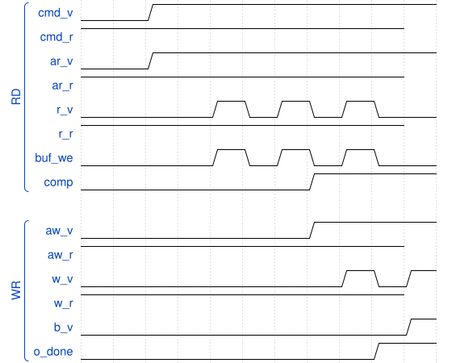

## 4. 附加模块的设计

### 4.1 DMA 引擎

#### 4.1.1 设计总体思路

DMA 模块采用非常明确的“命令接口 + AXI 主口 + 简单双向流接口”结构。`fa_dma_reader` 接收来自调度器的 `cmd_valid/cmd_ready/cmd_addr/cmd_len`，将其转化为 AXI 读地址突发，再把返回的 R 通道 beat 原样流式送往下游 tile buffer。`fa_dma_writer` 则接受写命令和写数据流，先发起 AXI 写地址，再连续消费输入数据 beat，最后等待写响应完成一个事务。这样的接口形式有两个优点。其一，调度器只需要关心“从哪个地址开始搬多少 beat”，不需要直接操作 AXI 的五个通道。其二，后端 compute core 可以把访存看作简单的流输入和流输出，从而减少控制状态机与总线协议之间的耦合。

读取 DMA 内部支持对过长逻辑命令进行分裂。当总读 beat 数超过 AXI `ARLEN` 能够编码的范围时，模块会自动把一条长命令拆成多个 burst 并递增地址继续读取。这一能力已在 `test_split_long_command` 中得到验证。对本项目而言，这一点的重要性在于它使调度器可以统一以 tile 为粒度给出逻辑长度，而不必人工考虑底层 AXI burst 的最大长度限制。

#### 4.1.2 工作流程及错误处理

读 DMA 的状态机可概括为 `AR_IDLE -> AR_SEND -> AR_STREAM`。在 `AR_IDLE` 状态接收到命令后，模块首先根据剩余 beat 数裁剪出本次 burst 的长度；在 `AR_SEND` 状态与 AXI 地址通道完成握手；随后进入 `AR_STREAM`，在每拍 `RVALID && RREADY` 时向下游输出一个 beat，并更新剩余 beat 计数。当一个 burst 完成而总事务尚未结束时，状态机会自动回到 `AR_SEND` 继续下一个 burst。任何一次 `RRESP != OKAY` 都会将 `error` 置为粘滞态，以便上层统一发现故障。写 DMA 的结构与此对称，其状态机为 `W_IDLE -> W_ADDR -> W_DATA -> W_RESP`，并对 `BRESP` 做粘滞错误记录。

从验证结果看，DMA 模块的行为已经比较稳定。`fa_dma_reader` 的单测覆盖了单 burst、错误标记、字节计数、背靠背命令和超长命令拆分；`fa_dma_writer` 的单测覆盖了写 burst、响应错误和写字节统计。顶层 full-run perf counters 读回的 `DMA_RD_CMD_COUNT`、`DMA_WR_CMD_COUNT`、`DMA_RD_BEAT_COUNT`、`DMA_WR_BEAT_COUNT` 还能与内存模型的统计互相校验，这说明 DMA 模块不仅功能正确，而且其计数口径也足以支撑后续系统级性能分析。

### 4.2 AXI-Lite Config 的实现

#### 4.2.1 AXI-Lite 配置寄存器

AXI-Lite 配置寄存器由 `fa_axi_lite_regs` 实现。其内部使用典型的写地址与写数据分离锁存结构：只有当地址与数据都到齐、且当前没有未完成的写响应时，才视为一次 `write_fire`。读通道则根据 `ARADDR` 直接组合多路选择出 `RDATA`，并用 `RVALID` 做单周期响应控制。这样的实现方式足以覆盖当前简单寄存器文件的需求，同时避免引入更复杂的寄存器总线桥接逻辑。

控制寄存器的语义设计与赛题要求基本对齐。`CTRL` 中 bit0 表示启动脉冲，bit1 表示软复位，bit2 预留为中断使能；`STATUS` 中包含 busy、done-sticky 和 error；`CFG` 当前主要承载 `causal_en`。四组 64bit 基地址通过高低 32bit 寄存器拼接形成 `Q_BASE/K_BASE/V_BASE/O_BASE`。此外，还包括 `STRIDE_BYTES`、`NEG_LARGE`、`SCALE` 和 `CYCLES` 等寄存器。为了支撑架构级调优，又额外加入了 `0x80~0xD4` 的性能计数器窗口，使上层软件无需内部探针即可读取本轮运行的微观行为统计。

#### 4.2.2 寄存器具体功能对照表

表 4-1 给出当前主用寄存器及功能说明。

| 偏移 | 名称 | 功能说明 |
|---|---|---|
| `0x00` | `CTRL` | bit0 启动脉冲，bit1 软复位，bit2 中断使能 |
| `0x04` | `STATUS` | bit0 busy，bit1 done-sticky，bit2 error；支持写 1 清 done |
| `0x08` | `CFG` | bit0 为 `causal_en` |
| `0x14/0x18` | `Q_BASE_L/H` | Q 基地址低 32bit 与高 32bit |
| `0x1C/0x20` | `K_BASE_L/H` | K 基地址低 32bit 与高 32bit |
| `0x24/0x28` | `V_BASE_L/H` | V 基地址低 32bit 与高 32bit |
| `0x2C/0x30` | `O_BASE_L/H` | O 基地址低 32bit 与高 32bit |
| `0x34` | `STRIDE_BYTES` | 行跨度，默认 `128` bytes |
| `0x38` | `NEG_LARGE` | 因果掩码使用的大负数，默认 `0xFFFF8000` |
| `0x3C` | `SCALE` | 缩放因子 Q8.8，默认 `32` |
| `0x40` | `CYCLES` | 当前运行周期计数 |
| `0x80~0xD4` | `PERF_*` | 运行次数、DMA 统计、子状态占时、乘法/指数/倒数计数 |

这种寄存器组织方式在软件接口层非常直接。一方面，它使 host 侧可以把当前 IP 看成标准的“配置—启动—轮询完成—读统计”设备；另一方面，也为未来 UVM reg model 和 SoC driver 的统一抽象提供了天然接口边界。

## 4.3 0324 新增控制与队列语义

0310 版本的控制平面以“单任务配置 + start”语义为主；0324 版本在不破坏 baseline 的前提下新增了队列化能力，形成了“staging descriptor + queue command/status + auto scheduler”的结构。

### 4.3.1 队列寄存器窗口

新增并稳定使用以下地址窗口：

- `0x44` `REG_QUEUE_CMD`
- `0x48` `REG_QUEUE_STATUS`
- `0x4C` `REG_QUEUE_CAPACITY`
- `0x50` `REG_TASK_ACCEPT_COUNT`
- `0x54` `REG_TASK_DONE_COUNT`
- `0x58` `REG_TASK_ERROR_COUNT`
- `0x5C` `REG_LAST_ERROR`

`QUEUE_STATUS` 的位域语义已固定为可软件轮询的组合状态：

1. `queue_empty`
2. `queue_full`
3. `queue_ready_for_enqueue`
4. `queue_busy_exec`
5. `queue_count/free_slots`
6. `overflow/underflow/desc_error sticky`

这套位域在软件侧可直接实现“可入队判定 + 容量估算 + 异常恢复”。

### 4.3.2 descriptor 校验与异常处理

当前入队前校验已覆盖：

1. `stride_bytes != 0`
2. `scale_q8_8 != 0`
3. `Q/K/V/O base` 16B 对齐
4. `stride_bytes` 16B 对齐

不满足时拒绝入队并置位 `desc_error_sticky`。此外：

1. `flush_queue` 仅清空 pending，不打断 active；
2. 空队列下 flush 会触发 `underflow_sticky`；
3. sticky 位可通过命令寄存器单独清除。

该异常语义已经在 cocotb 顶层测试覆盖，不再停留在寄存器定义层。

## 4.4 AXI-Lite 的扩展字段与兼容边界

除了 queue 相关字段，本阶段还在部分分支预留了未来可扩展字段：

1. `DATA_FMT`（Bonus #5）
2. `VALID_LEN`（Bonus #4）
3. `NUM_HEADS/HEAD_STRIDE`（Bonus #2）
4. `PRECISION_MODE`（BF16/FP16 研究线）

当前这些字段在不同分支成熟度不同，但一个重要工程原则已经确立：

- baseline 只启用严格必要字段；
- bonus 字段独立分支验证，不回写污染 baseline 结论。

这一点直接降低了“功能扩展导致主线回归不确定性”的风险。

## 4.5 DMA 语义的阶段划分

0324 版本需要明确区分两类 DMA 语义，避免报告口径混淆：

1. 主线 Q8.8 IP 的真实 DMA 握手路径（top-level AXI master）；
2. FP8 full-core 实验中的 phase/beat 模型计数（更接近事件建模，不等价于主线 DMA 协议完整实现）。

前者用于 baseline 合规；后者用于低精度原型阶段的性能可视化。该边界在 0324 报告中必须显式标注，防止把实验核计数误认成可提交 IP 的 DMA 证据。

## 4.6 接口演进建议

基于当前实现状态，控制/数据平面后续建议如下：

1. 保持 AXI-Lite 作为统一控制面，不为 bonus9 单独引入 instruction-fetch 控制器。
2. task queue 优先走 descriptor/FIFO 路线，保持与现有 regbank 兼容。
3. AXI4-Stream 若推进，建议作为独立 top wrapper，与 DMA top 并存，避免影响 baseline 驱动与验收脚本。

该策略能保证“接口创新”和“baseline 可交付”并行推进。
